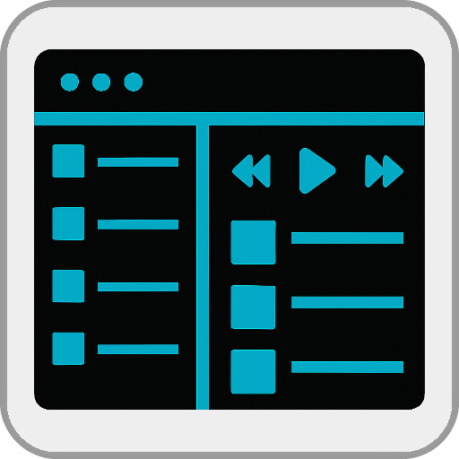

Dark Logic Skin
====
%3D'plugin'%20and%20%40name%3D'DarkLogicSkin'%5D%2F%40minTarget&prefix=v&label=Min.%20LMS%20Version%20Required&color=darkgreen) 

Based on the LMS *Logic Teal* skin, but some UI elements have darker colors.  

> [!IMPORTANT]
>️ Please **clear your browser cache** after switching or updating web skins and **reload** the browser page (multiple times if necessary).
 

[⬅️ **Back to the list of all plugins**](https://github.com/AF-1/)
  
**Use the** &nbsp;  &nbsp;**icon** (top right) to **jump directly to a specific section.**

   

## What it is and what it is not
The only purpose of *Dark Logic Skin* is to provide a dark-themed version of the *LMS Logic Teal skin* where some UI elements have darker colors. 
It's only about the **colors** of the UI elements, **not** about adding or (re)moving UI elements, and definitely not about changing how *LMS Logic Teal skin* works. *Dark Logic Skin* does and will **not** provide any additional functionality beyond that of the *LMS Logic Teal skin*. And some UI elements are not modified.
   

## Installation

* **Dark Logic Skin** is available from the LMS plugin library: **LMS > Settings > Manage Plugins**. 

* Once the plugin is installed, go to `LMS > Settings > Interface`, select `Dark Logic` and click *Apply*.

* Don't forget to **clear your browser cache**.

   

## Report a new issue

To report a new issue please file a GitHub [**issue report**](https://github.com/AF-1/lms-darklogicskin/issues/new/choose).
   

## ⭐ Help others discover this project

If you find this project useful, giving it a  (top right of this page) is a great way to show your support and help others discover it. Thank you.
    
